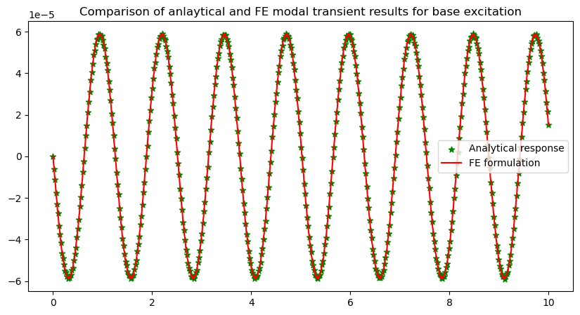

# Rattle analysis using modal transient simulation

Rattle decreases the percieved quality of vehicles 

this project demonstrates how modal transient anlaysis is done in the backend of NVH simulation tools
this was independently developed out of interest during the author's internship time in TVS motor company.

no company specific details are attached in this page. All the attached results are developed generically for cantilever beam.

### FE formulation:

Beam equation: 

FE forrmulation stiffness and mass matrix: 

Assumptions:

equation that is solved:

BCs:

modal analysis: 

importance of modal analysis: 

Transient analysis:

Verification:

results and discussion:

